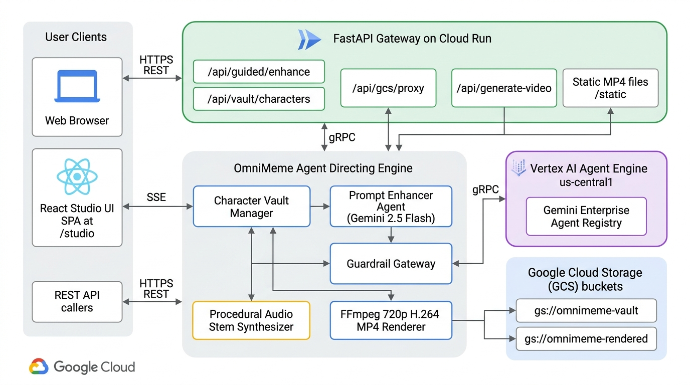
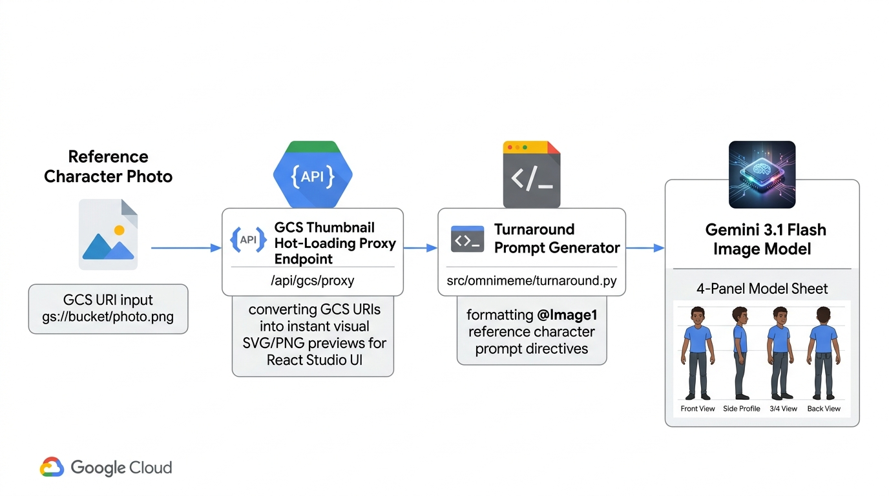
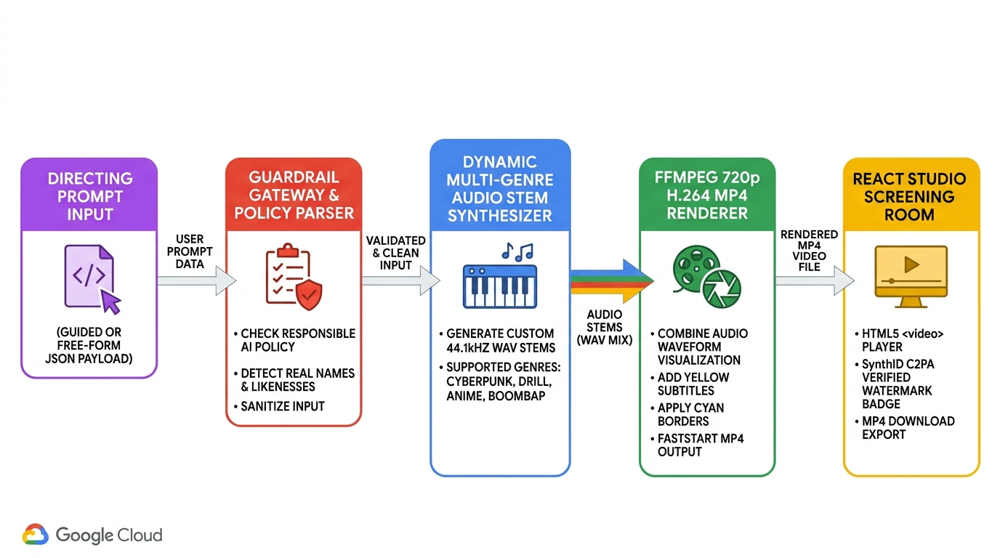
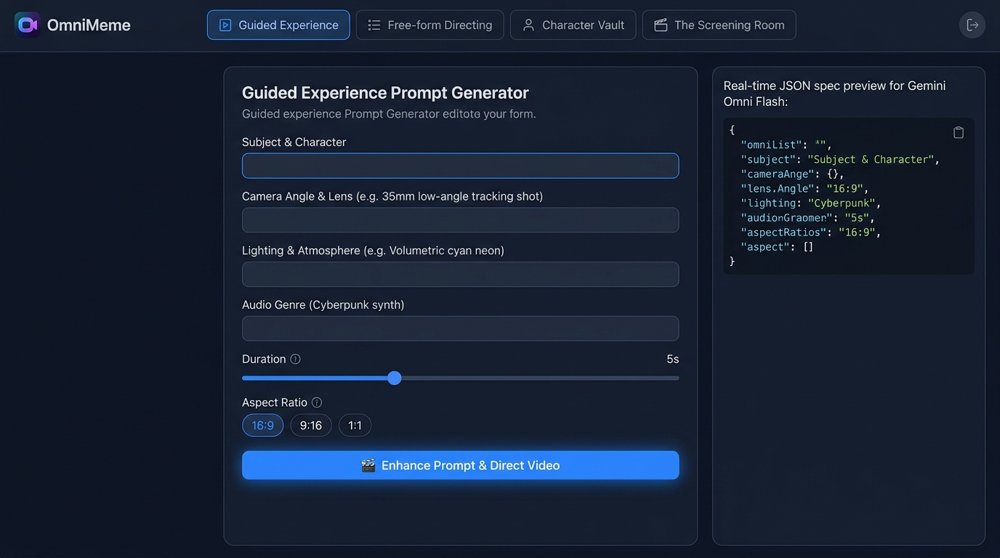
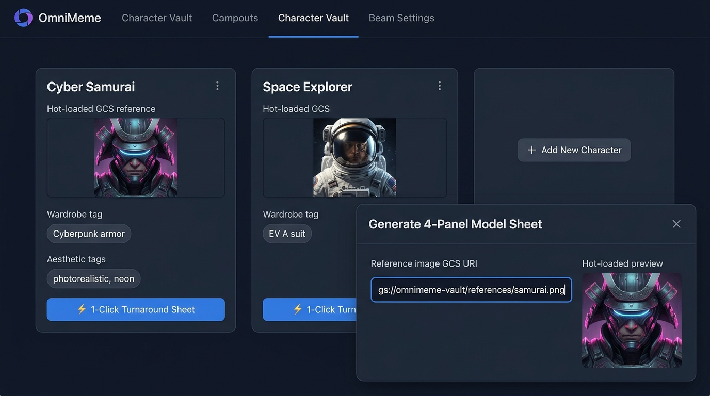
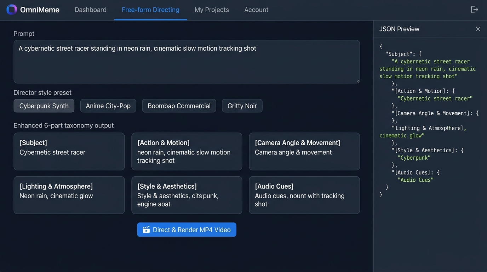
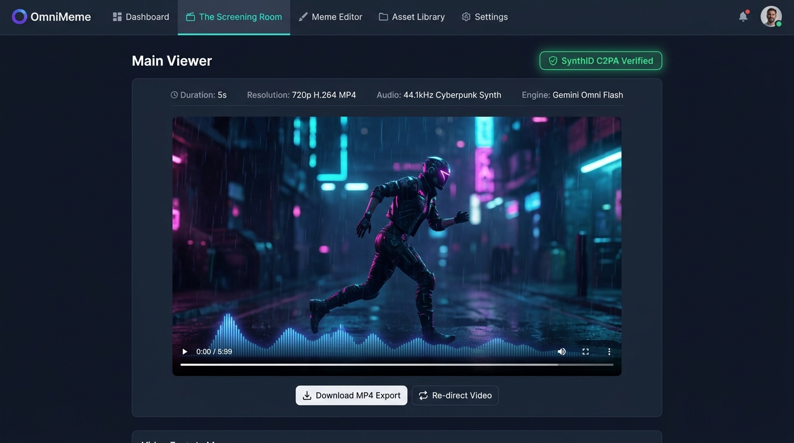

# OmniMeme - Gemini Omni Flash Video Directing Studio


---

## 📝 Description

OmniMeme is an ADK-based agentic video directing studio in Python and React designed to assist creators in direct-engineering cinematic prompts for **Gemini Omni Flash preview**. Powered by Google's latest **Agent Development Kit (`google-adk==2.7.1`)** and `agentplatform.Client()`, it expands raw user ideas into a precise 6-part video directing taxonomy covering camera dynamics, motion pacing, atmospheric lighting, aesthetic styles, and audio timing.

The system features an **OmniFlash Execution Engine** with procedural audio stem synthesis, **Responsible AI policy guardrails**, **Character Vault** for 4-panel model sheets with GCS image proxy hot-loading, and **The Screening Room** React viewer with SynthID C2PA verification and MP4 export.

---

## 🏛️ System Architecture & Visualizations

### 1. End-to-End System Architecture


### 2. Character Turnaround & GCS Reference Hot-Loading Workflow


### 3. Gemini Omni Flash Video Execution Engine & Safety Guardrail Pipeline


---

## ✨ Key Features

- **🎬 6-Part Directing Taxonomy Expansion**: Transforms simple text prompts into structured visual directives (`[Subject]`, `[Action & Motion]`, `[Camera Angle & Movement]`, `[Lighting & Atmosphere]`, `[Style & Aesthetics]`, `[Audio Cues]`).
- **👤 Character Vault & Model Sheet Generator**: Store character profiles and generate 4-panel orthographic model turnaround sheets (front, profile, 3/4, back) using Gemini 3.1 Flash Image.
- **🖼️ GCS Reference Image Hot-Loading**: Enter any `gs://` bucket URI for a reference photo and preview hot-loaded SVG/PNG thumbnails instantly via the `/api/gcs/proxy` endpoint.
- **⚡ OmniFlash Video Execution Engine**: Connects Gemini Omni Flash JSON configurations directly to dynamic video execution, procedural 44.1kHz audio stem synthesis (cyberpunk, drill, anime, boombap), and FFmpeg 720p H.264 MP4 rendering.
- **🛡️ Responsible AI Guardrail Gateway**: Parses policy errors (`parse_guardrail_error_guidance`) for real names/likenesses and suggests automatic prompt sanitization.
- **🎬 The Screening Room UI**: HTML5 video viewer with **`🛡️ SynthID C2PA Verified`** watermark badge, video metadata display, 1-click execution, and MP4 download export.
- **🌐 Dual Cloud Deployment**: Live on **Cloud Run** (`https://omnimeme-934903580331.us-central1.run.app`) and registered with **Gemini Enterprise Agent Registry**.


---

## 🖥️ Studio UI User Journey

### Step 1: Guided Experience Prompt Generator
Direct camera angles, lenses, atmospheric lighting, audio genres, duration, and aspect ratio via structured controls.


### Step 2: Character Vault & Model Sheet Generator
Manage character profiles with hot-loaded GCS reference image previews and generate 4-panel turnaround model sheets in 1 click.


### Step 3: Free-form Directing & 6-Part Taxonomy Expansion
Input natural language text prompts, apply director style presets, and preview real-time 6-part taxonomy expansions and JSON payloads.


### Step 4: The Screening Room & MP4 Video Export
Screen rendered 720p H.264 MP4 videos with native HTML5 playback, dynamic audio spectrum visualizer, SynthID C2PA verification badges, and 1-click MP4 export.


---

## 🏗️ Tech Stack


| Layer | Component / Technology | Version | Purpose |
| :--- | :--- | :--- | :--- |
| **Agent Framework** | `google-adk` | `2.7.1` | Agent Development Kit core orchestration & tool binding |
| **Platform Client** | `google-agentplatform` | `0.2.0` | Enterprise platform client (`agentplatform.Client`) |
| **Generative SDK** | `google-genai` | `2.19.0` | Google GenAI SDK for Gemini models |
| **Cloud AI Platform** | `google-cloud-aiplatform` | `>=1.163.0` | Vertex AI Agent Engine & evaluation SDK |
| **Backend Server** | `fastapi` & `uvicorn` | `0.141.1` / `0.52.4` | REST API server for workflow execution |
| **Package Manager** | `uv` | `>=0.1.0` | Fast Python environment & lockfile management |
| **Linter & Formatter** | `ruff` | `>=0.4.0` | Fast Python linting & formatting |
| **Type Checker** | `ty` | `>=0.0.1` | Modern static type checker |
| **Testing Framework** | `pytest` | `9.1.1` | Unit, contract, and API test suite |
| **Frontend UI** | React, Vite, TypeScript | `18.2.0` / `5.4.21` / `5.2.2` | Interactive single-page studio web app |

---

## 🚀 Getting Started / Installation

### System Requirements
- **Node.js**: `>=18.0.0`
- **Python**: `>=3.11, <3.14`
- **uv**: Installed (`uv tool install uv` or via official installer)

### 1. Clone & Environment Setup

```bash
git clone https://github.com/tottenjordan/omnimeme.git
cd omnimeme
```

Copy the environment template file:

```bash
cp .env.example .env
```

Edit `.env` to configure your GCP project:

```ini
GOOGLE_CLOUD_PROJECT=your-gcp-project-id
GOOGLE_CLOUD_LOCATION=us-central1
PORT=8000
VITE_API_BASE_URL=http://localhost:8000/api
```

### 2. Backend Setup (Python)

Install Python dependencies using `uv`:

```bash
uv sync --all-groups
```

### 3. Frontend Setup (React)

Install Node packages for the web interface:

```bash
cd frontend
npm install
cd ..
```

---

## 💻 Usage Examples

### 1. Launching the Backend Server

Start the FastAPI REST backend on port `8000`:

```bash
uv run uvicorn omnimeme.server.app:app --reload --port 8000
```

### 2. Launching the Web UI Studio

In a separate terminal, launch the React + Vite dev server:

```bash
cd frontend
npm run dev
```

Open your browser at `http://localhost:5173`.

---

### 3. Python API Usage

You can invoke the ADK agent programmatically in Python:

```python
from omnimeme.agent import create_omni_director_agent
from omnimeme.ui.guided_experience import GuidedPromptInput, process_guided_request

# Instantiate the ADK Directing Agent
agent = create_omni_director_agent()

# Define structured guided parameters
guided_input = GuidedPromptInput(
    subject="Cyberpunk samurai under neon rain",
    action="Drawing a glowing sword",
    camera="Low angle 35mm steadycam tracking shot",
    lighting="Volumetric cyan and magenta neon reflections",
    duration_sec=7,
    aspect_ratio="16:9",
)

# Execute the directing workflow
response = process_guided_request(guided_input, agent)

print("Enhanced Directing Prompt:\n", response["result"]["enhanced_prompt"])
print("Video Payload Spec:\n", response["result"]["video_config"])
```

---

### 4. REST API Usage (cURL)

#### Guided Experience Endpoint (`POST /api/guided/enhance`)

```bash
curl -X POST http://localhost:8000/api/guided/enhance \
  -H "Content-Type: application/json" \
  -d '{
    "subject": "Astronaut floating near Saturn",
    "action": "Reaching out toward ice ring particles",
    "camera": "Wide orbital push-in",
    "duration_sec": 6,
    "aspect_ratio": "16:9"
  }'
```

#### Free-form Text Widget Endpoint (`POST /api/freeform/enhance`)

```bash
curl -X POST http://localhost:8000/api/freeform/enhance \
  -H "Content-Type: application/json" \
  -d '{
    "raw_prompt": "A golden retriever wearing sunglasses riding a skateboard down a hill",
    "director_style_preference": "Upbeat 4K commercial"
  }'
```

---

### 5. CLI Execution Example

You can also run the agent workflow directly from the command line:

```bash
uv run python -m omnimeme.main freeform "A futuristic drone soaring through a neon valley"
```

---

## 🧪 Testing

### Running Backend Unit & Server Tests
Run the automated `pytest` test suite:

```bash
uv run pytest
```

Run linting, static type checks, and unit tests using the project `Makefile`:

```bash
make check
```

### Building the Frontend SPA
Validate frontend TypeScript compilation and bundle production assets:

```bash
cd frontend
npm run build
```

---

## 🤝 Contributing & License

Contributions are welcome! Please follow these guidelines:
1. Ensure code conforms to repository standards (`uv run ruff check .`, `uv run ty check src/`, `uv run pytest`).
2. Do **not** add `Co-Authored-By` trailers to git commit messages.
3. Open a Pull Request with a clear explanation of your changes.

### License
Distributed under the **Apache 2.0 License**. See `LICENSE` for details.
