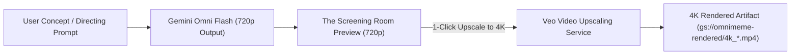

# Architecture Design: Veo 1080p / 4K Video Upscaling Integration

This document outlines the architectural specification and API payload design for upscaling 720p Gemini Omni Flash videos to 1080p and 4K resolution using the Veo Video Upscaling API.

---

## 🎯 Architectural Overview

Gemini Omni Flash outputs native 720p videos (3s–10s, 24 FPS) via the Interactions API. Veo Video Upscaling provides high-fidelity post-processing to upscale these generated clips to 1080p or 4K.



---

## 📋 API Payload Specification

### Endpoint
`POST https://aiplatform.googleapis.com/v1beta1/projects/PROJECT_ID/locations/global/publishers/google/models/veo-video-upscale:predict`

### Request Body
```json
{
  "instances": [
    {
      "gcs_uri": "gs://omnimeme-rendered/omni_f0897a96.mp4",
      "target_resolution": "4K",
      "target_fps": 30
    }
  ],
  "parameters": {
    "upscale_factor": "4x",
    "enhance_details": true
  }
}
```

---

## 🚀 Future Implementation Tasks (On Hold)

1. Add `veo_upscaler.py` in `src/omnimeme/` wrapping the Vertex AI Veo Upscaling endpoint.
2. Add `POST /api/upscale` in `src/omnimeme/server/app.py`.
3. Add **"✨ Upscale to 4K"** action button on Screening Room video player cards in `frontend/src/App.tsx`.
